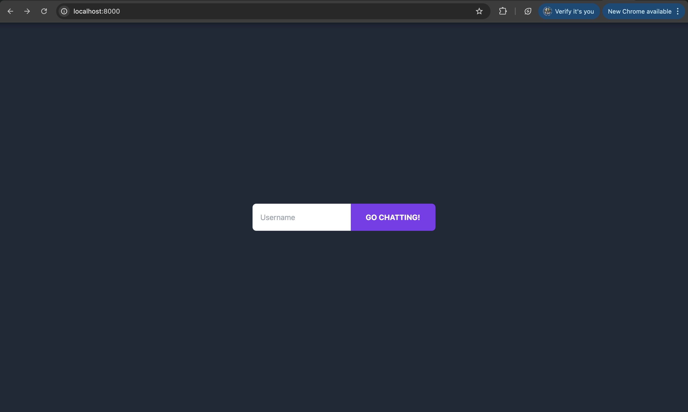
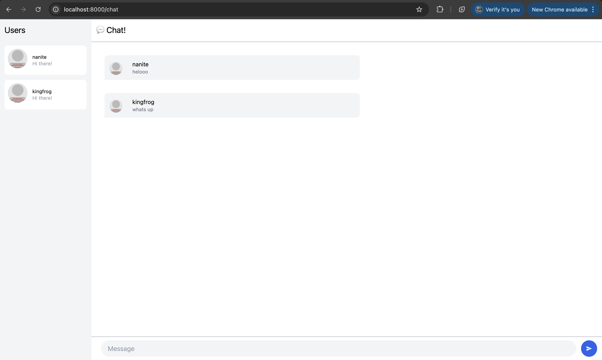
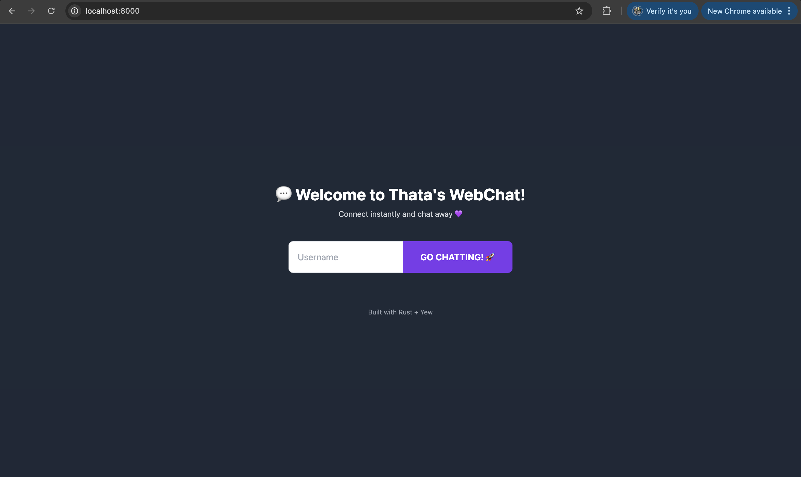
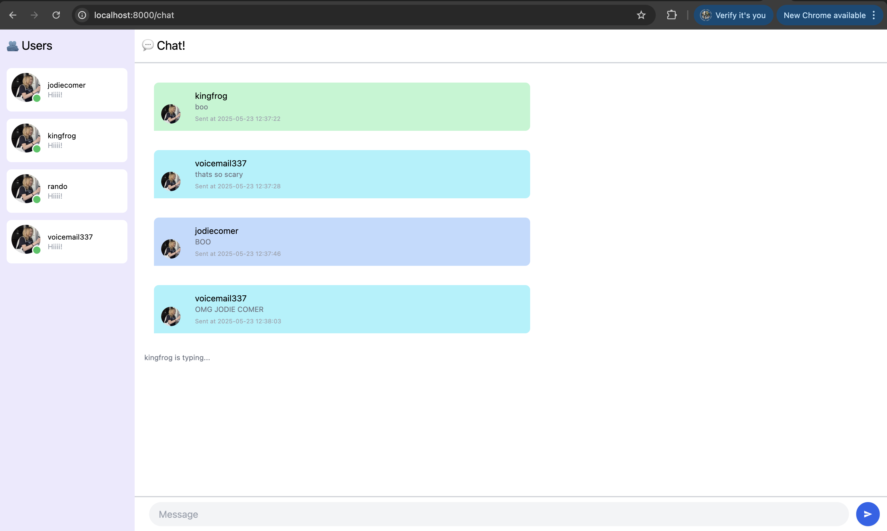

# Advanced Programming Module 10 - Webchat
### Athazahra Nabila Ruby - 2306173113

> Original code
 

> Be creative!
 

In the login page, I added a welcome message and a footer by modifying the html on login.rs

In the chat page:
- Typing Indicator
I implemented a "typing..." indicator that appears when another user is typing. This is done by sending a typing WebSocket message whenever the input field changes (oninput). The message includes the username of the one typing. When the message is received, the UI displays <username> is typing... at the bottom of the message area if it's not the current user.

- Online Indicator
I added a small green circle below each user's avatar in the user list to show they’re online. This is done by rendering a green dot using Tailwind's bg-green-400 and rounded-full classes. All users in the WebSocket connection are considered online, and the list is updated every 5 seconds via the server's users message.

- Stying
For fun, I customized the user list panel by changing its background color to a soft purple (bg-purple-100). I also changed the default avatar for all users to a picture of my favorite actress, Jodie Comer, by modifying the avatar URL inside the UserProfile creation logic.